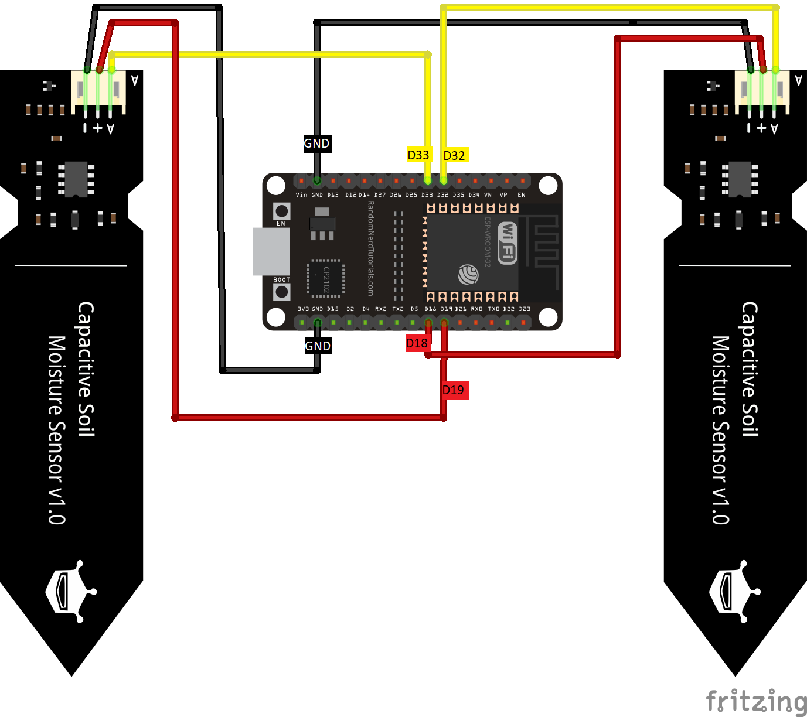

# Getting started with the ESPRESSIF ESP32 for Verified Telemetry

## What you need

* [ESPRESSIF ESP32 Board](https://www.espressif.com/en/products/devkits)

* USB 2.0 A male to Micro USB male cable

* WiFi Connection

* [ESP-IDF](https://idf.espressif.com/) (Version 4.3 for Microsoft Windows or 4.4 for Linux)

In this tutorial you use Verified Telemetry and FreeRTOS to connect the ESPRESSIF ESP32 Board - DOIT Esp32 DevKit v1 (hereafter, ESP32 Kit) to Azure IoT and provide the feature of Telemetry Verification to two telemetries. 

You will complete the following tasks:

* Install a set of embedded development tools for programming ESP32 Kit in C
* Connect two external sensors whose telemetry would be supported by Verified Telemetry feature
* Build an image and flash it onto ESP32 Kit

## Table of Contents

* [Prerequisites](#prerequisites)
* [Prepare the development environment](#prepare-the-development-environment)
* [Prepare Azure resources](#prepare-azure-resources)
* [Connect Sensors for Verified Telemetry](#connect-sensors-for-verified-telemetry)
* [Prepare and Flash Firmware](#prepare-and-flash-firmware)
* [Next Steps](#next-steps-verified-telemetry)

## Prerequisites

1. GIT

    Install `git` following the [official website](https://git-scm.com/).

2. ESP-IDF

    Install the [Espressif ESP-IDF](https://docs.espressif.com/projects/esp-idf/en/latest/esp32/get-started/index.html#get-started) following Espressif official documentation (steps 1 to 4).

3. Verified Telemetry for FreeRTOS


    Clone the following repo to download all sample device code, setup scripts, and offline versions of the documentation.

    **If you previously cloned this repo in another sample, you don't need to do it again.**

    ```shell
    git clone --recursive https://github.com/Azure-Samples/Verified-Telemetry-FreeRTOS-Sample.git
    ```

    You may also need to enable long path support for both Microsoft Windows and git:
    * Windows: <https://docs.microsoft.com/windows/win32/fileio/maximum-file-path-limitation?tabs=cmd#enable-long-paths-in-windows-10-version-1607-and-later>
    * Git: as Administrator run `git config --system core.longpaths true`

4. Hardware

    > * ESP32 Board. 
    > * Wi-Fi 2.4 GHz
    > * USB 2.0 A male to Micro USB male cable
    > * 2 * [Soil Moisture Sensor](https://www.dfrobot.com/product-1385.html)


## Prepare the development environment

To set up your development environment, first you clone a GitHub repo that contains all the assets you need for the tutorial. Then you install a set of programming tools.

## Prepare Azure resources

To run this sample you can create a device on your Azure IoT Hub.

IoT Hub |
---------|
Have an [Azure IoT Hub](https://docs.microsoft.com/azure/iot-hub/iot-hub-create-through-portal) created |
Have a [logical device](https://docs.microsoft.com/azure/iot-hub/iot-hub-create-through-portal#register-a-new-device-in-the-iot-hub) created in your Azure IoT Hub. |

Confirm that you have Copied the the following values from your Iot Hub and the device created

> * `hostName`
> * `deviceId`
> * `primaryKey`

## Connect Sensors for Verified Telemetry
This sample showcases Verified Telemetry feature for telemetry generated from two external sensors that are connected to STM DevKit
* Connect Sensors        


    Refer to the table and image below to connect the two [Soil Moisture](https://www.dfrobot.com/product-1385.html) sensors With DOIT Esp32 DevKit v1.

    | Sensor Name   | Sensor Pin           | MCU Pin | Devkit Pin |
    |---------------|----------------------|-----------------------------|------------|
    | Soil Moisture 1 | Analog Out           | ADC Unit 1 Channel 4                           | D32        |
    | Soil Moisture 1 | VCC                  | GPIO18                          | D18        |
    | Soil Moisture 1 | GND                  | GND                          | GND        |
    | Soil Moisture 2       | Analog Out  | ADC Unit 1 Channel 5                          | D33        |
    | Soil Moisture 2       | VCC                  | GPIO19                           | D19     |
    | Soil Moisture 2       | GND                  | GND                           | GND       |


    


### Update sample configuration

The configuration of the ESPRESSIF ESP32 sample uses ESP-IDF' samples standard [kconfig](https://docs.espressif.com/projects/esp-idf/en/latest/esp32/api-reference/kconfig.html) configuration.

On a [console with ESP-IDF](https://docs.espressif.com/projects/esp-idf/en/latest/esp32/get-started/index.html#step-4-set-up-the-environment-variables), run the following commands:

```shell
cd demos\projects\ESPRESSIF\esp32
idf.py menuconfig
```

Under menu item `Azure IoT middleware for FreeRTOS Sample Configuration`, update the following configuration values:

Parameter | Value
---------|----------
 `WiFi SSID` | _{Your WiFi SSID}_
 `WiFi Password` | _{Your WiFi password}_


Under menu item `Azure IoT middleware for FreeRTOS Main Task Configuration`, update the following configuration values:

Parameter | Value
---------|----------
 `Azure IoT Hub FQDN` | _{Your Azure IoT Hub Host FQDN}_
 `Azure IoT Device ID` | _{Your Azure IoT Hub device ID}_
 `Azure IoT Device Symmetric Key` | _{Your Azure IoT Hub device symmetric key}_

> Some parameters contain default values that do not need to be updated.

Save the configuration (`Shift + S`) inside the sample folder in a file with name `sdkconfig`.
After that, close the configuration utility (`Shift + Q`).

## Build the image

> This step assumes your are in the ESPRESSIF ESP32 sample directory (same as configuration step above).

To build the device image, run the following command:

```shell
idf.py build
```

## Prepare and Flash Firmware

1. Connect the Micro USB cable to the Micro USB port on the ESPRESSIF ESP32 board, and then connect it to your computer.

2. Find the COM port mapped for the device on your system.

    On **Windows**, go to `Device Manager`, `Ports (COM & LTP)`. Look for a "CP210x"-based device and take note of the COM port mapped for your device (e.g. "COM5").

    On **Linux**, save and run the following script:

    ```shell
    #!/bin/bash
    # Copyright (c) Microsoft Corporation.
    # Licensed under the MIT License. */

    # Lists all USB devices and their paths

    for sysdevpath in $(find /sys/bus/usb/devices/usb*/ -name dev); do
        (
            syspath="${sysdevpath%/dev}"
            devname="$(udevadm info -q name -p $syspath)"
            [[ "$devname" == "bus/"* ]] && exit
            eval "$(udevadm info -q property --export -p $syspath)"
            [[ -z "$ID_SERIAL" ]] && exit
            echo "/dev/$devname - $ID_SERIAL"
        )
    done
    ```

    Considering the script was saved as `list-usb-devices.sh`, run:

    ```bash
    chmod 777 ./list-usb-devices.sh
    ./list-usb-devices.sh
    ```

    Look for a "CP2102"-based entry and take note of the path mapped for your device (e.g. "/dev/ttyUSB0").

3. Run the following command:

    > This step assumes you are in the ESPRESSIF ESP32 sample directory (same as configuration step above).

    ```bash
    idf.py -p <COM port> flash
    ```

    <details>
    <summary>Example...</summary>

    On **Windows**:

    ```shell
    idf.py -p COM5 flash
    ```

    On **Linux**:

    ```shell
    idf.py -p /dev/ttyUSB0 flash
    ```
    </details>

## Confirm device connection

You can use any terminal application to monitor the operation of the device and confirm it is set up correctly.

Alternatively you can use ESP-IDF monitor:

```bash
idf.py -p <COM port> monitor
```

The output should show traces similar to:

<details>
<summary>See more...</summary>

```shell
idf.py -p COM6 monitor
Executing action: monitor
Running idf_monitor in directory d:\ms_esp\verified-telemetry-freertos-sample-22\demos\projects\espressif\esp32
Executing "C:\Users\handa\.espressif\python_env\idf4.3_py3.8_env\Scripts\python.exe C:\Users\handa\Desktop\esp-idf\tools/idf_monitor.py -p COM6 -b 115200 --toolchain-prefix xtensa-esp32-elf- d:\ms_esp\verified-telemetry-freertos-sample-22\demos\projects\espressif\esp32\build\azure_iot_freertos_esp32.elf -m 'C:\Users\handa\.espressif\python_env\idf4.3_py3.8_env\Scripts\python.exe' 'C:\Users\handa\Desktop\esp-idf\tools\idf.py' '-p' 'COM6'"...
←[0;33m--- WARNING: GDB cannot open serial ports accessed as COMx←[0m
←[0;33m--- Using \\.\COM6 instead...←[0m
--- idf_monitor on \\.\COM6 115200 ---
--- Quit: Ctrl+] | Menu: Ctrl+T | Help: Ctrl+T followed by Ctrl+H ---
ets Jun  8 2016 00:22:57

rst:0x1 (POWERON_RESET),boot:0x13 (SPI_FAST_FLASH_BOOT)
configsip: 0, SPIWP:0xee
clk_drv:0x00,q_drv:0x00,d_drv:0x00,cs0_drv:0x00,hd_drv:0x00,wp_drv:0x00
mode:DIO, clock div:2
load:0x3fff0030,len:7008
load:0x40078000,len:14292
ho 0 tail 12 room 4
load:0x40080400,len:3688
0x40080400: _init at ??:?

entry 0x40080678
I (28) boot: ESP-IDF v4.3 2nd stage bootloader
I (28) boot: compile time 13:30:49
I (29) boot: chip revision: 1
I (31) boot_comm: chip revision: 1, min. bootloader chip revision: 0
I (38) boot.esp32: SPI Speed      : 40MHz
I (43) boot.esp32: SPI Mode       : DIO
I (47) boot.esp32: SPI Flash Size : 2MB
I (52) boot: Enabling RNG early entropy source...
I (57) boot: Partition Table:
I (61) boot: ## Label            Usage          Type ST Offset   Length
I (68) boot:  0 nvs              WiFi data        01 02 00009000 00006000
I (76) boot:  1 phy_init         RF data          01 01 0000f000 00001000
I (83) boot:  2 factory          factory app      00 00 00010000 00100000
I (91) boot: End of partition table
I (95) boot_comm: chip revision: 1, min. application chip revision: 0
I (102) esp_image: segment 0: paddr=00010020 vaddr=3f400020 size=24358h (148312) map
I (166) esp_image: segment 1: paddr=00034380 vaddr=3ffb0000 size=043e4h ( 17380) load
I (174) esp_image: segment 2: paddr=0003876c vaddr=40080000 size=078ach ( 30892) load
I (187) esp_image: segment 3: paddr=00040020 vaddr=400d0020 size=9cfe8h (643048) map
I (430) esp_image: segment 4: paddr=000dd010 vaddr=400878ac size=0ddfch ( 56828) load
I (454) esp_image: segment 5: paddr=000eae14 vaddr=50000000 size=00010h (    16) load
I (466) boot: Loaded app from partition at offset 0x10000
I (467) boot: Disabling RNG early entropy source...
I (478) cpu_start: Pro cpu up.
I (478) cpu_start: Starting app cpu, entry point is 0x400812f8
0x400812f8: call_start_cpu1 at C:/Users/handa/Desktop/esp-idf/components/esp_system/port/cpu_start.c:141

I (0) cpu_start: App cpu up.
I (495) cpu_start: Pro cpu start user code
I (495) cpu_start: cpu freq: 160000000
I (495) cpu_start: Application information:
I (499) cpu_start: Project name:     azure_iot_freertos_esp32
I (506) cpu_start: App version:      1532448-dirty
I (511) cpu_start: Compile time:     Sep  1 2021 13:30:14
I (517) cpu_start: ELF file SHA256:  1eae0ea8bdf5c42a...
I (523) cpu_start: ESP-IDF:          v4.3
I (528) heap_init: Initializing. RAM available for dynamic allocation:
I (535) heap_init: At 3FFAE6E0 len 00001920 (6 KiB): DRAM
I (541) heap_init: At 3FFBA050 len 00025FB0 (151 KiB): DRAM
I (547) heap_init: At 3FFE0440 len 00003AE0 (14 KiB): D/IRAM
I (554) heap_init: At 3FFE4350 len 0001BCB0 (111 KiB): D/IRAM
I (560) heap_init: At 400956A8 len 0000A958 (42 KiB): IRAM
I (567) spi_flash: detected chip: generic
I (571) spi_flash: flash io: dio
W (575) spi_flash: Detected size(4096k) larger than the size in the binary image header(2048k). Using the size in the binary image header.
I (589) cpu_start: Starting scheduler on PRO CPU.
I (0) cpu_start: Starting scheduler on APP CPU.
I (730) wifi:wifi driver task: 3ffbbb30, prio:23, stack:6656, core=0
I (730) system_api: Base MAC address is not set
I (730) system_api: read default base MAC address from EFUSE
I (740) wifi:wifi firmware version: c7d0450
I (740) wifi:wifi certification version: v7.0
I (740) wifi:config NVS flash: enabled
I (740) wifi:config nano formating: disabled
I (750) wifi:Init data frame dynamic rx buffer num: 32
I (750) wifi:Init management frame dynamic rx buffer num: 32
I (760) wifi:Init management short buffer num: 32
I (760) wifi:Init dynamic tx buffer num: 32
I (770) wifi:Init static rx buffer size: 1600
I (770) wifi:Init static rx buffer num: 10
I (770) wifi:Init dynamic rx buffer num: 32
I (780) wifi_init: rx ba win: 6
I (780) wifi_init: tcpip mbox: 32
I (790) wifi_init: udp mbox: 6
I (790) wifi_init: tcp mbox: 6
I (790) wifi_init: tcp tx win: 5744
I (800) wifi_init: tcp rx win: 5744
I (800) wifi_init: tcp mss: 1440
I (810) wifi_init: WiFi IRAM OP enabled
I (810) wifi_init: WiFi RX IRAM OP enabled
I (820) sample_azureiot: Connecting to E051...
I (820) phy_init: phy_version 4670,719f9f6,Feb 18 2021,17:07:07
I (930) wifi:mode : sta (9c:9c:1f:c6:0c:fc)
I (930) wifi:enable tsf
I (930) sample_azureiot: Waiting for IP(s)
I (2980) wifi:new:<3,0>, old:<1,0>, ap:<255,255>, sta:<3,0>, prof:1
I (3710) wifi:state: init -> auth (b0)
I (3720) wifi:state: auth -> assoc (0)
I (3730) wifi:state: assoc -> run (10)
I (3830) wifi:connected with E051, aid = 5, channel 3, BW20, bssid = 5c:f9:fd:71:d0:49
I (3830) wifi:security: WPA2-PSK, phy: bgn, rssi: -57
I (3830) wifi:pm start, type: 1

I (3880) wifi:AP's beacon interval = 102400 us, DTIM period = 1
W (3990) wifi:<ba-add>idx:0 (ifx:0, 5c:f9:fd:71:d0:49), tid:0, ssn:2, winSize:64
I (5120) esp_netif_handlers: sample_azureiot: sta ip: 192.168.1.33, mask: 255.255.255.0, gw: 192.168.1.1
I (5120) sample_azureiot: Got IPv4 event: Interface "sample_azureiot: sta" address: 192.168.1.33
I (5130) sample_azureiot: Connected to sample_azureiot: sta
I (5130) sample_azureiot: - IPv4 address: 192.168.1.33
I (5140) sample_azureiot: Waiting for time synchronization with SNTP server
I (7060) sample_azureiot: Notification of a time synchronization event
I (7150) AZ IOT: Creating a TLS connection to AzureRtosPnP.azure-devices.net:8883.

I (9770) tls_freertos: (Network connection 0x3ffca06c) Connection to AzureRtosPnP.azure-devices.net established.
I (9770) AZ IOT: Creating an MQTT connection to AzureRtosPnP.azure-devices.net.

```
</details>


## Next Steps ***Verified Telemetry***
* With this sample, you have now setup Verified Telemetry device sample on STM Devkit
* To understand how to interact and consume Verified Telemetry components, refer to the following guide - 
    * Interact with Verified Telemetry using our [custom Solution Sample Template](https://github.com/Azure/Verified-Telemetry-Solution-Sample) which uses a Grafana Dashboard
