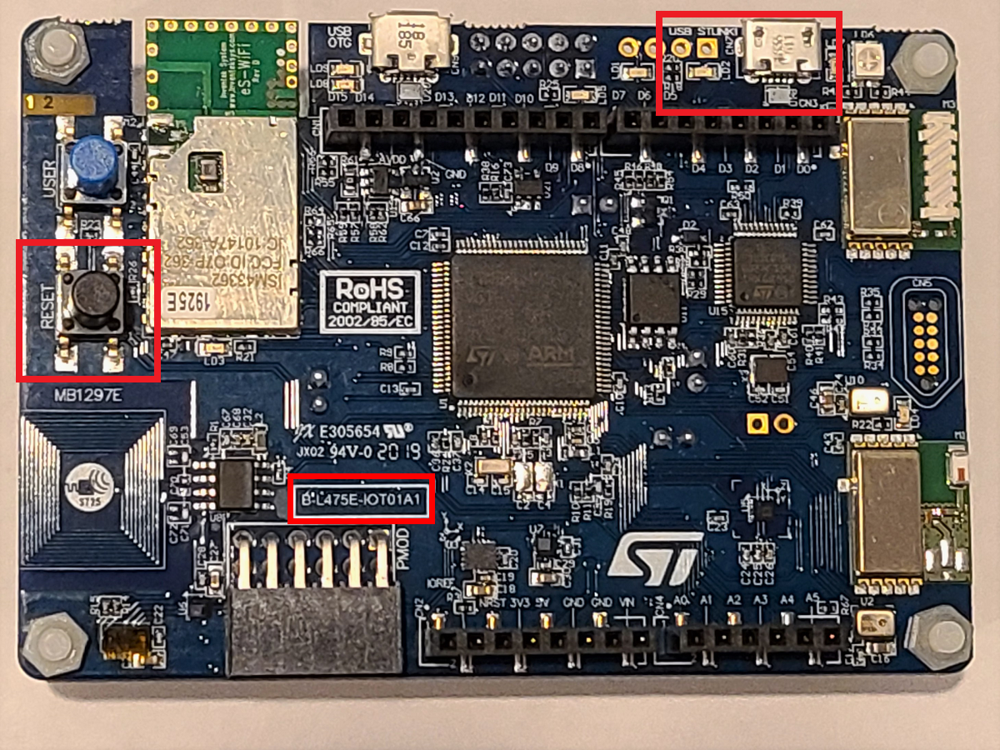

# Getting started with the STMicroelectronics B-L475E-IOT01A Discovery kits for Verified Telemetry

## What you need

* ST Microelectronics DevKit: [B-L475E-IOT01A](https://www.st.com/en/evaluation-tools/b-l475e-iot01a.html)

* Wi-Fi 2.4 GHz

* Micro USB male cable

In this tutorial you use Verified Telemetry and FreeRTOS to connect the B-L475E-IOT01A Discovery kit (hereafter, the STM DevKit) to Azure IoT and provide the feature of Telemetry Verification to two telemetries. 

You will complete the following tasks:

* Install a set of embedded development tools for programming the STM DevKit in C
* Connect two external sensors whose telemetry would be supported by Verified Telemetry feature
* Build an image and flash it onto the STM DevKit

## Table of Contents

* [Prerequisites](#prerequisites)
* [Prepare the development environment](#prepare-the-development-environment)
* [Prepare Azure resources](#prepare-azure-resources)
* [Connect Sensors for Verified Telemetry](#connect-sensors-for-verified-telemetry)
* [Prepare and Flash Firmware](#prepare-and-flash-firmware)
* [Next Steps](#next-steps-verified-telemetry)


## Prerequisites

* A PC running Microsoft Windows 10
* If you don't have an Azure subscription, [create one for free](https://azure.microsoft.com/free/?WT.mc_id=A261C142F) before you begin.
* [Git](https://git-scm.com/downloads) for cloning the repository
* Hardware

    > * STM DevKit. The tutorial works with.
    >   * [B-L475E-IOT01A](https://www.st.com/en/evaluation-tools/b-l475e-iot01a.html)
    > * Wi-Fi 2.4 GHz
    > * USB 2.0 A male to Micro USB male cable
    > * 1 * PM2012 Sensor(Digital Sensor)
    > * 2 * Soil Moisture Sensor(Analog Sensor)


## Prepare the development environment

To set up your development environment, first you clone a GitHub repo that contains all the assets you need for the tutorial. Then you install a set of programming tools.

### Clone the repo for the tutorial

Clone the following repo to download all sample device code, setup scripts, and offline versions of the documentation.
To clone the repo, run the following command:

```shell
git clone https://github.com/Azure-Samples/Verified-Telemetry-FreeRTOS-Sample.git --recursive
```

### Install the tools

The cloned repo contains a setup script that installs and configures the required tools. If you have installed these tools in another tutorial in the getting started guide, you don't need to do it again.

> Note: The setup script installs the following tools:
> * [GCC](https://developer.arm.com/tools-and-software/open-source-software/developer-tools/gnu-toolchain/gnu-rm): Compile
> * [CMake](https://cmake.org): Build
> * [Termite](https://www.compuphase.com/software_termite.htm): Monitor COM port output for connected devices
> * [Azure IoT Explorer](https://github.com/Azure/azure-iot-explorer/releases): Cross-platform utility to  monitor and manage Azure IoT resources

Ensure that cmake, ninja and the ARM toolset binaries are available in the `PATH` environment variable.

You may also need to enable long path support for both Windows and git:
* Windows: <https://docs.microsoft.com/windows/win32/fileio/maximum-file-path-limitation?tabs=cmd#enable-long-paths-in-windows-10-version-1607-and-later>
* Git: As **administrator** run `git config --system core.longpaths true`

## Prepare Azure resources

To run this sample you can create a device on your Azure IoT Hub.

IoT Hub |
---------|
Have an [Azure IoT Hub](https://docs.microsoft.com/azure/iot-hub/iot-hub-create-through-portal) created |
Have a [logical device](https://docs.microsoft.com/azure/iot-hub/iot-hub-create-through-portal#register-a-new-device-in-the-iot-hub) created in your Azure IoT Hub. |

Confirm that you have Copied the the following values from your Iot Hub and the device created

> * `hostName`
> * `deviceId`
> * `primaryKey`

## Connect Sensors for Verified Telemetry

Verified Telemetry supports both Analog and Digital Sensors for which we have developed different Fingerprinting Technologies. To use only one type of sensors or to add more sensors, minimal changes are required to the sample, refer the [Sensor Configuration Guide](../../../../demos/sample_azure_iot_pnp/) which would walk you through the connection diagrams and the code modifications.


## Prepare the device
To connect the STM DevKit to Azure, you'll modify a configuration file for Wi-Fi and Azure IoT settings, rebuild the image, and flash the image to the device.

Update the file `Verified-Telemetry-FreeRTOS-Sample/demos/projects/ST/b-l475e-iot01a/config/demo_config.h` with your configuration values.

Set the **Wi-Fi parameters** to the following values for your local environment.

Parameter | Value 
---------|----------
 `WIFI_SSID` | _{Your Wi-Fi SSID}_
 `WIFI_PASSWORD` | _{Your Wi-Fi Password}_ 

Set the following parameters:

Parameter | Value 
---------|----------
 `democonfigDEVICE_ID` | _{Your Device ID value}_
 `democonfigHOSTNAME` | _{Your Azure IoT Hub Host name value}_ 
 `democonfigDEVICE_SYMMETRIC_KEY` | _{Your Primary Key value}_ 

## Prepare and Flash Firmware

To build the device image, navigate to the `Verified-Telemetry-FreeRTOS-Sample` directory and run the following commands:

  ```bash
    cmake -G Ninja -DVENDOR=ST -DBOARD=b-l475e-iot01a -Bb-l475e-iot01a .
  ```
  
Following changes are required in library files.

1. stm32l475e_iot01.c (Verified-Telemetry-FreeRTOS-Sample\b-l475e-iot01a\_deps\stm32cubel4-src\Drivers\BSP\B-L475E-IOT01\stm32l475e_iot01.c)

      * Add following lines under line 82 in above file, values required for COM2 Port Initialization.
          ```bash
            USART_TypeDef* COM2_USART[COMn] = {DISCOVERY_COM2};

            GPIO_TypeDef* COM2_TX_PORT[COMn] = {DISCOVERY_COM2_TX_GPIO_PORT};

            GPIO_TypeDef* COM2_RX_PORT[COMn] = {DISCOVERY_COM2_RX_GPIO_PORT};

            const uint16_t COM2_TX_PIN[COMn] = {DISCOVERY_COM2_TX_PIN};

            const uint16_t COM2_RX_PIN[COMn] = {DISCOVERY_COM2_RX_PIN};

            const uint16_t COM2_TX_AF[COMn] = {DISCOVERY_COM2_TX_AF};

            const uint16_t COM2_RX_AF[COMn] = {DISCOVERY_COM2_RX_AF};
          ```

      * Add following lines under line 317 in above file **after function BSP_COM_Init()**, COM2 Port Initialization Function definition.
          ```bash
            void BSP_COM2_Init(COM_TypeDef COM, UART_HandleTypeDef *huart)
            {
              GPIO_InitTypeDef gpio_init_structure;

              /* Enable GPIO clock */
              DISCOVERY_COMy_TX_GPIO_CLK_ENABLE(COM);
              DISCOVERY_COMy_RX_GPIO_CLK_ENABLE(COM);

              /* Enable USART clock */
              DISCOVERY_COMy_CLK_ENABLE(COM);

              /* Configure USART Tx as alternate function */
              gpio_init_structure.Pin = COM2_TX_PIN[COM];
              gpio_init_structure.Mode = GPIO_MODE_AF_PP;
              gpio_init_structure.Speed = GPIO_SPEED_FREQ_HIGH;
              gpio_init_structure.Pull = GPIO_NOPULL;
              gpio_init_structure.Alternate = COM2_TX_AF[COM];
              HAL_GPIO_Init(COM2_TX_PORT[COM], &gpio_init_structure);

              /* Configure USART Rx as alternate function */
              gpio_init_structure.Pin = COM2_RX_PIN[COM];
              gpio_init_structure.Mode = GPIO_MODE_AF_PP;
              gpio_init_structure.Alternate = COM2_RX_AF[COM];
              HAL_GPIO_Init(COM2_RX_PORT[COM], &gpio_init_structure);

              /* USART configuration */
              huart->Instance = COM2_USART[COM];
              HAL_UART_Init(huart);
            }
          ```

2. stm32l475e_iot01.h (Verified-Telemetry-FreeRTOS-Sample\b-l475e-iot01a\_deps\stm32cubel4-src\Drivers\BSP\B-L475E-IOT01\stm32l475e_iot01.h)

      * Add following lines under line 152 in above file, various defines for COM2 Port.
          ```bash
            #define DISCOVERY_COM2                          UART4
            #define DISCOVERY_COM2_CLK_ENABLE()             __HAL_RCC_UART4_CLK_ENABLE()
            #define DISCOVERY_COM2_CLK_DISABLE()            __HAL_RCC_UART4_CLK_DISABLE()

            #define DISCOVERY_COM2_TX_PIN                   GPIO_PIN_0
            #define DISCOVERY_COM2_TX_GPIO_PORT             GPIOA
            #define DISCOVERY_COM2_TX_GPIO_CLK_ENABLE()     __HAL_RCC_GPIOA_CLK_ENABLE()   
            #define DISCOVERY_COM2_TX_GPIO_CLK_DISABLE()    __HAL_RCC_GPIOA_CLK_DISABLE()  
            #define DISCOVERY_COM2_TX_AF                    GPIO_AF8_UART4

            #define DISCOVERY_COM2_RX_PIN                   GPIO_PIN_1
            #define DISCOVERY_COM2_RX_GPIO_PORT             GPIOA
            #define DISCOVERY_COM2_RX_GPIO_CLK_ENABLE()     __HAL_RCC_GPIOA_CLK_ENABLE()   
            #define DISCOVERY_COM2_RX_GPIO_CLK_DISABLE()    __HAL_RCC_GPIOA_CLK_DISABLE()  
            #define DISCOVERY_COM2_RX_AF                    GPIO_AF8_UART4

            #define DISCOVERY_COM2_IRQn                     UART4_IRQn

            #define DISCOVERY_COMy_CLK_ENABLE(__INDEX__)            do { if((__INDEX__) == COM2) {DISCOVERY_COM2_CLK_ENABLE();}} while(0)
            #define DISCOVERY_COMy_CLK_DISABLE(__INDEX__)           do { if((__INDEX__) == COM2) {DISCOVERY_COM2_CLK_DISABLE();}} while(0)

            #define DISCOVERY_COMy_TX_GPIO_CLK_ENABLE(__INDEX__)    do { if((__INDEX__) == COM2) {DISCOVERY_COM2_TX_GPIO_CLK_ENABLE();}} while(0)
            #define DISCOVERY_COMy_TX_GPIO_CLK_DISABLE(__INDEX__)   do { if((__INDEX__) == COM2) {DISCOVERY_COM2_TX_GPIO_CLK_DISABLE();}} while(0)

            #define DISCOVERY_COMy_RX_GPIO_CLK_ENABLE(__INDEX__)    do { if((__INDEX__) == COM2) {DISCOVERY_COM2_RX_GPIO_CLK_ENABLE();}} while(0)
            #define DISCOVERY_COMy_RX_GPIO_CLK_DISABLE(__INDEX__)   do { if((__INDEX__) == COM2) {DISCOVERY_COM2_RX_GPIO_CLK_DISABLE();}} while(0)
          ```
      * Add following lines under line 241 in above file **after function BSP_COM_Init()** declaration, COM2 function declaration.
          ```bash
            void             BSP_COM2_Init(COM_TypeDef COM, UART_HandleTypeDef *huart);
          ```

3. stm32l4xx_hal_uart.c (Verified-Telemetry-FreeRTOS-Sample\b-l475e-iot01a\_deps\stm32cubel4-src\Drivers\STM32L4xx_HAL_Driver\Src\stm32l4xx_hal_uart.c)

      * Add following lines under line 1215 in above file, UART4 receiving function definition.
          ```bash
            HAL_StatusTypeDef HAL_UART4_Receive(UART_HandleTypeDef *huart, uint8_t *pData, uint16_t Size, uint32_t Timeout)
            { 

            uint8_t  *pdata8bits;
              uint16_t *pdata16bits;
              uint16_t uhMask;
              uint32_t tickstart;

              /* Check that a Rx process is not already ongoing */
              if (huart->RxState == HAL_UART_STATE_READY)
              {
                if ((pData == NULL) || (Size == 0U))
                {
                  return  HAL_ERROR;
                }

                __HAL_LOCK(huart);

                huart->ErrorCode = HAL_UART_ERROR_NONE;
                huart->RxState = HAL_UART_STATE_BUSY_RX;

                /* Init tickstart for timeout managment*/
                tickstart = HAL_GetTick();

                huart->RxXferSize  = Size;
                huart->RxXferCount = Size;

                /* Computation of UART mask to apply to RDR register */
                UART_MASK_COMPUTATION(huart);
                uhMask = huart->Mask;

                /* In case of 9bits/No Parity transfer, pRxData needs to be handled as a uint16_t pointer */
                if ((huart->Init.WordLength == UART_WORDLENGTH_9B) && (huart->Init.Parity == UART_PARITY_NONE))
                {
                  pdata8bits  = NULL;
                  pdata16bits = (uint16_t *) pData;
                }
                else
                {
                  pdata8bits  = pData;
                  pdata16bits = NULL;
                }

                __HAL_UNLOCK(huart);

                /* as long as data have to be received */
                while (huart->RxXferCount > 0U)
                {
                  if (UART_WaitOnFlagUntilTimeout(huart, UART_FLAG_RXNE, RESET, tickstart, Timeout) != HAL_OK)
                  {
                    return HAL_TIMEOUT;
                  }
                  if (pdata8bits == NULL)
                  {
                    *pdata16bits = (uint16_t)(huart->Instance->RDR & uhMask);
                    pdata16bits++;
                  }
                  else
                  {
                    *pdata8bits = (uint8_t)(huart->Instance->RDR & (uint8_t)uhMask);
                    pdata8bits++;
                  }
                  __HAL_UART_CLEAR_FLAG(huart, UART_CLEAR_NEF | UART_CLEAR_OREF);
                  huart->RxXferCount--;
                }

                /* At end of Rx process, restore huart->RxState to Ready */
                huart->RxState = HAL_UART_STATE_READY;

                return HAL_OK;
              }
              else
              {
                return HAL_BUSY;
              }
            }
          ```

4. stm32l4xx_hal_uart.h (Verified-Telemetry-FreeRTOS-Sample\b-l475e-iot01a\_deps\stm32cubel4-src\Drivers\STM32L4xx_HAL_Driver\Inc\stm32l4xx_hal_uart.h)

      * Add following lines under line 1617 in above file, UART4 receiving function declaration.
          ```bash
            HAL_StatusTypeDef HAL_UART4_Receive(UART_HandleTypeDef *huart, uint8_t *pData, uint16_t Size, uint32_t Timeout);
          ```

  ```bash
    cmake --build b-l475e-iot01a
  ```

After the build completes, confirm that a folder named `/b-l475e-iot01a` was created. 

### Flash the image

1. Connect the Micro USB cable to the USB STLINK port on the STM DevKit, and then connect it to your computer.

2. In File Explorer, find the binary file that you created in the previous section and copy it.

3. In File Explorer, find the STM Devkit that's connected to your computer. The device appears as a drive on your system with the drive label `DIS_L4IOT`.

4. Paste the binary file into the root folder of the STM Devkit. Flashing starts automatically and completes in a few seconds.

  

### Confirm device connection details

You can use the **Termite** utility to monitor communication and confirm that your device is set up correctly.
> Note: If you have issues getting your device to initialize or connect after flashing, see [Troubleshooting](../../docs/troubleshooting.md).

1. Start **Termite**.
1. Select **Settings**.
1. In the **Serial port settings** dialog, check the following settings and update if needed:
    * **Baud rate**: 115,200
    * **Port**: The port that your STM DevKit is connected to. If there are multiple port options in the dropdown, you can find the correct port to use. Open Windows **Device Manager**, and view **Ports** to identify which port to use.

    
1. Select OK.
1. Press the **Reset** button on the device. The button is black and is labeled on the device.
1. In the **Termite** console, check the following checkpoint values to confirm that the device is initialized and connected to Azure IoT. This now completes flashing VT code to the device. Please follow the next steps below to interact with the device.


```output
WiFi module initialized.
STM32L4XX Lib:
> CMSIS Device Version: 1.7.0.0.
> HAL Driver Version: 1.12.0.0.
> BSP Driver Version: 1.1.6.0.
ES-WIFI MAC Address: C4:7F:51:7:D1:59
ES-WIFI Connected.
> ES-WIFI IP Address: 192.168.1.29
---------STARTING DEMO---------
[INFO] [AZ IOT] [prvConnectToServerWithBackoffRetries:1457] Creating a TLS connection to AzureRtosPnP.azure-devices.net:8883.

[INFO] [AZ IOT] [prvAzureDemoTask:1259] Creating an MQTT connection to AzureRtosPnP.azure-devices.net.

[INFO] [MQTT] [receivePacket:885] Packet received. ReceivedBytes=2.
[INFO] [MQTT] [deserializeConnack:970] CONNACK session present bit not set.
[INFO] [MQTT] [logConnackResponse:912] Connection accepted.
[INFO] [MQTT] [receiveConnack:1563] Received MQTT CONNACK successfully from broker.
[INFO] [MQTT] [MQTT_Connect:1829] MQTT connection established with the broker.
[INFO] [MQTT] [receivePacket:885] Packet received. ReceivedBytes=3.
[INFO] [MQTT] [receivePacket:885] Packet received. ReceivedBytes=4.
[INFO] [MQTT] [receivePacket:885] Packet received. ReceivedBytes=82.
[INFO] [MQTT] [handleIncomingPublish:1044] De-serialized incoming PUBLISH packet: DeserializerResult=MQTTSuccess.
[INFO] [MQTT] [handleIncomingPublish:1057] State record updated. New state=MQTTPublishDone.
[INFO] [AZ IOT] [prvHandleProperties:1069] Property document payload : {"desired":{"$version":1},"reported":{"$version":1}} 

[INFO] [AZ IOT] [prvHandleProperties:1074] Device property document GET received
[INFO] [AZ IOT] [prvProcessReportedProperties:1043] Successfully parsed properties
enable Verified Telemetry property 1 
[INFO] [AZ IOT] [prvAzureDemoTask:1283] Attempt to receive publish message from IoT Hub.
```

## Next Steps ***Verified Telemetry***
* With this sample, you have now setup Verified Telemetry device sample on STM Devkit
* To understand how to interact and consume Verified Telemetry components, refer to the following guide - 
    * Interact with Verified Telemetry using our [custom Solution Sample Template](https://github.com/Azure/Verified-Telemetry-Solution-Sample) which uses a Grafana Dashboard
