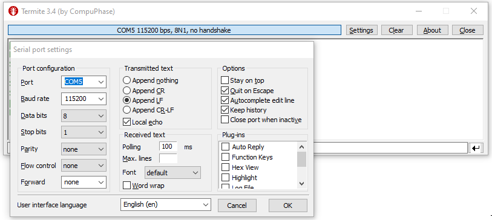

# Getting started with the STMicroelectronics B-L475E-IOT01A Discovery kits for Verified Telemetry

## What you need

* ST Microelectronics DevKit: [B-L475E-IOT01A](https://www.st.com/en/evaluation-tools/b-l475e-iot01a.html)

* Wi-Fi 2.4 GHz

* Micro USB male cable

In this tutorial you use Verified Telemetry and FreeRTOS to connect the B-L475E-IOT01A Discovery kit (hereafter, the STM DevKit) to Azure IoT and provide the feature of Telemetry Verification to two telemetries. 

You will complete the following tasks:

* Install a set of embedded development tools for programming the STM DevKit in C
* Connect two external sensors whose telemetry would be supported by Verified Telemetry feature
* Build an image and flash it onto the STM DevKit

## Table of Contents

* [Prerequisites](#prerequisites)
* [Prepare the development environment](#prepare-the-development-environment)
* [Prepare Azure resources](#prepare-azure-resources)
* [Connect Sensors for Verified Telemetry](#connect-sensors-for-verified-telemetry)
* [Prepare and Flash Firmware](#prepare-and-flash-firmware)
* [Next Steps](#next-steps-verified-telemetry)


## Prerequisites

* A PC running Microsoft Windows 10
* If you don't have an Azure subscription, [create one for free](https://azure.microsoft.com/free/?WT.mc_id=A261C142F) before you begin.
* [Git](https://git-scm.com/downloads) for cloning the repository
* Hardware

    > * STM DevKit. The tutorial works with.
    >   * [B-L475E-IOT01A](https://www.st.com/en/evaluation-tools/b-l475e-iot01a.html)
    > * Wi-Fi 2.4 GHz
    > * USB 2.0 A male to Micro USB male cable
    > * 2 * [Soil Moisture Sensor](https://www.dfrobot.com/product-1385.html)


## Prepare the development environment

To set up your development environment, first you clone a GitHub repo that contains all the assets you need for the tutorial. Then you install a set of programming tools.

### Clone the repo for the tutorial

Clone the following repo to download all sample device code, setup scripts, and offline versions of the documentation.
To clone the repo, run the following command:

```shell
git clone --recursive https://github.com/Azure-Samples/Verified-Telemetry-FreeRTOS-Sample.git
```

### Install the tools

The cloned repo contains a setup script that installs and configures the required tools. If you have installed these tools in another tutorial in the getting started guide, you don't need to do it again.

> Note: The setup script installs the following tools:
> * [GCC](https://developer.arm.com/tools-and-software/open-source-software/developer-tools/gnu-toolchain/gnu-rm): Compile
> * [CMake](https://cmake.org): Build
> * [Termite](https://www.compuphase.com/software_termite.htm): Monitor COM port output for connected devices
> * [Azure IoT Explorer](https://github.com/Azure/azure-iot-explorer/releases): Cross-platform utility to  monitor and manage Azure IoT resources

Ensure that cmake, ninja and the ARM toolset binaries are available in the `PATH` environment variable.

You may also need to enable long path support for both Windows and git:
* Windows: <https://docs.microsoft.com/windows/win32/fileio/maximum-file-path-limitation?tabs=cmd#enable-long-paths-in-windows-10-version-1607-and-later>
* Git: As **administrator** run `git config --system core.longpaths true`

## Prepare Azure resources

To run this sample you can create a device on your Azure IoT Hub.

IoT Hub |
---------|
Have an [Azure IoT Hub](https://docs.microsoft.com/azure/iot-hub/iot-hub-create-through-portal) created |
Have a [logical device](https://docs.microsoft.com/azure/iot-hub/iot-hub-create-through-portal#register-a-new-device-in-the-iot-hub) created in your Azure IoT Hub. |

Confirm that you have Copied the the following values from your Iot Hub and the device created

> * `hostName`
> * `deviceId`
> * `primaryKey`

## Connect Sensors for Verified Telemetry
This sample showcases Verified Telemetry feature for telemetry generated from two external sensors that are connected to STM DevKit
* Connect Sensors        


    Refer to the table and image below to connect the two [Soil Moisture](https://www.dfrobot.com/product-1385.html) sensors.

    | Sensor Name   | Sensor Pin           | MCU Pin | Devkit Pin |
    |---------------|----------------------|-----------------------------|------------|
    | Soil Moisture 1 | Analog Out           | PC0                           | A5        |
    | Soil Moisture 1 | VCC                  | PB9                          | D14        |
    | Soil Moisture 1 | GND                  | GND                          | GND        |
    | Soil Moisture 2       | Analog Out  | PC1                           | A4        |
    | Soil Moisture 2       | VCC                  | PB8                           | D15       |
    | Soil Moisture 2       | GND                  | GND                           | GND       |


    


## Prepare the device
To connect the STM DevKit to Azure, you'll modify a configuration file for Wi-Fi and Azure IoT settings, rebuild the image, and flash the image to the device.

Update the file `Verified-Telemetry-FreeRTOS-Sample/demos/projects/ST/b-l475e-iot01a/config/demo_config.h` with your configuration values.

Set the **Wi-Fi parameters** to the following values for your local environment.

Parameter | Value 
---------|----------
 `WIFI_SSID` | _{Your Wi-Fi SSID}_
 `WIFI_PASSWORD` | _{Your Wi-Fi Password}_ 

Set the following parameters:

Parameter | Value 
---------|----------
 `democonfigDEVICE_ID` | _{Your Device ID value}_
 `democonfigHOSTNAME` | _{Your Azure IoT Hub Host name value}_ 
 `democonfigDEVICE_SYMMETRIC_KEY` | _{Your Primary Key value}_ 

## Prepare and Flash Firmware

To build the device image, navigate to the `Verified-Telemetry-FreeRTOS-Sample` directory and run the following commands:

  ```bash
    cmake -G Ninja -DVENDOR=ST -DBOARD=b-l475e-iot01a -Bb-l475e-iot01a .
    cmake --build b-l475e-iot01a
  ```

After the build completes, confirm that a folder named `/b-l475e-iot01a` was created. 

### Flash the image

1. Connect the Micro USB cable to the USB STLINK port on the STM DevKit, and then connect it to your computer.

2. In File Explorer, find the binary file that you created in the previous section and copy it.

3. In File Explorer, find the STM Devkit that's connected to your computer. The device appears as a drive on your system with the drive label `DIS_L4IOT`.

4. Paste the binary file into the root folder of the STM Devkit. Flashing starts automatically and completes in a few seconds.

  

### Confirm device connection details

You can use the **Termite** utility to monitor communication and confirm that your device is set up correctly.
> Note: If you have issues getting your device to initialize or connect after flashing, see [Troubleshooting](../../docs/troubleshooting.md).

1. Start **Termite**.
1. Select **Settings**.
1. In the **Serial port settings** dialog, check the following settings and update if needed:
    * **Baud rate**: 115,200
    * **Port**: The port that your STM DevKit is connected to. If there are multiple port options in the dropdown, you can find the correct port to use. Open Windows **Device Manager**, and view **Ports** to identify which port to use.

    
1. Select OK.
1. Press the **Reset** button on the device. The button is black and is labeled on the device.
1. In the **Termite** console, check the following checkpoint values to confirm that the device is initialized and connected to Azure IoT. This now completes flashing VT code to the device. Please follow the next steps below to interact with the device.

## Next Steps ***Verified Telemetry***
* With this sample, you have now setup Verified Telemetry device sample on STM Devkit
* To understand how to interact and consume Verified Telemetry components, refer to the following guide - 
    * Interact with Verified Telemetry using our [custom Solution Sample Template](https://github.com/Azure/Verified-Telemetry-Solution-Sample) which uses a Grafana Dashboard
