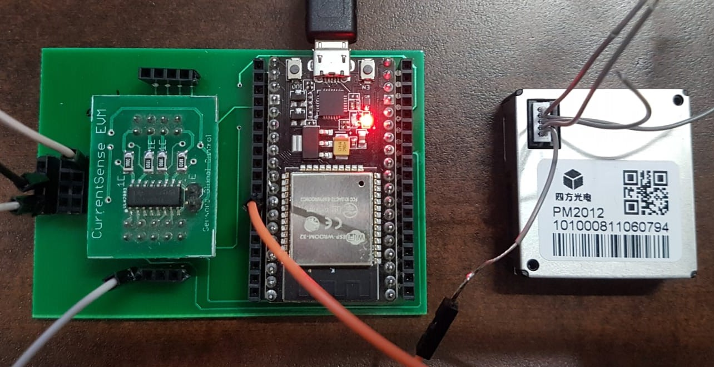

# Analog and Digital Sensors configuration guide for Verified Telemetry.

## Table of Contents

* [General Overview](#general-overview)
* [Sample configuration for both Analog and Digital Sensors](#sample-configuration-for-both-analog-and-digital-sensors)
* [Sample configuration for only Digital](#sample-configuration-for-only-digital-sensors)
* [Sample configuration for only Analog](#sample-configuration-for-only-analog-sensors)

## General Overview

Verified Telemetry supports both Analog and Digital Sensors, to use only one type of sensors or to add more sensors, changes are required to [sample_freertos_verified_telemetry_init.c](sample_freertos_verified_telemetry_init.c) file.

## Sample configuration for both Analog and Digital Sensors

* the default sample is configured for 2 Analog and 2 Digital sensors, use the below schematic for connections.

    * ESP32 Connection Schematic
    
   
    * STM Connection Schematic
    
    
## Sample configuration for only Digital Sensors

* the sample needs to be configured for only 2 Digital sensors, use the below schematic for connections, and the following instructions for changes in the [sample_freertos_verified_telemetry_init.c](sample_freertos_verified_telemetry_init.c) file.

* ESP32 Connections 

    * ESP32 Connection Schematic
    
    * ESP32 CS PCB Connections
    
    * ESP32 Sample Setup
    
    
* STM Connections

    * STM Connection Schematic
    
    * STM CS PCB Connections
    
    * STM Sample Setup
    
    
* Changes in file [sample_freertos_verified_telemetry_init.c](sample_freertos_verified_telemetry_init.c)

    * Comment lines 15 & 17
    
          //static FreeRTOS_VT_OBJECT sample_signature_sensor_1;
          
          //static FreeRTOS_VT_OBJECT sample_signature_sensor_2;

    * Comment lines 25 & 26
    
          //static VT_SENSOR_HANDLE sample_handle_sensor_1;
          //static VT_SENSOR_HANDLE sample_handle_sensor_2;
          
    * Comment lines 50 to 86
    
          /*
          sample_handle_sensor_1.adc_id         = vt_adc_id_sensor_1;
          sample_handle_sensor_1.adc_controller = (void*)&vt_adc_controller_sensor_1;
          sample_handle_sensor_1.adc_channel    = (void*)&vt_adc_channel_sensor_1;
          sample_handle_sensor_1.gpio_id        = vt_gpio_id_sensor_1;
          sample_handle_sensor_1.gpio_port      = (void*)vt_gpio_port_sensor_1;
          sample_handle_sensor_1.gpio_pin       = (void*)&vt_gpio_pin_sensor_1;

          if ((status = FreeRTOS_vt_signature_init(&verified_telemetry_DB,
                   &sample_signature_sensor_1,
                   (UCHAR*)"soilMoistureExternal1",
                   VT_SIGNATURE_TYPE_FALLCURVE,
                   (UCHAR*)"soilMoistureExternal1",
                   true,
                   &sample_handle_sensor_1)))
          {
              printf("Failed to initialize VT for soilMoistureExternal1 telemetry: error code = 0x%08x\r\n", status);
          }

          sample_handle_sensor_2.adc_id         = vt_adc_id_sensor_2;
          sample_handle_sensor_2.adc_controller = (void*)&vt_adc_controller_sensor_2;
          sample_handle_sensor_2.adc_channel    = (void*)&vt_adc_channel_sensor_2;
          sample_handle_sensor_2.gpio_id        = vt_gpio_id_sensor_2;
          sample_handle_sensor_2.gpio_port      = (void*)vt_gpio_port_sensor_2;
          sample_handle_sensor_2.gpio_pin       = (void*)&vt_gpio_pin_sensor_2;

          if ((status = FreeRTOS_vt_signature_init(&verified_telemetry_DB,
                   &sample_signature_sensor_2,
                   (UCHAR*)"soilMoistureExternal2",
                   VT_SIGNATURE_TYPE_FALLCURVE,
                   (UCHAR*)"soilMoistureExternal2",
                   true,
                   &sample_handle_sensor_2)))
          {
              printf("Failed to initialize VT for soilMoistureExternal2 telemetry: error code = 0x%08x\r\n", status);
          }
          */
          
## Sample configuration for only Analog Sensors

* the sample needs to be configured for only 2 Digital sensors, use the below schematic for connections, and the following instructions for changes in the [sample_freertos_verified_telemetry_init.c](sample_freertos_verified_telemetry_init.c) file.

* ESP32 Connections 

    * ESP32 Connection Schematic
    
    
* STM Connections

    * STM Connection Schematic
    
    
* Changes in file [sample_freertos_verified_telemetry_init.c](sample_freertos_verified_telemetry_init.c)

    * Comment lines 19 & 20
    
          //static FreeRTOS_VT_OBJECT sample_signature_sensor_3;

          //static FreeRTOS_VT_OBJECT sample_signature_sensor_4;

    * Comment lines 27 & 28
    
          //static VT_SENSOR_HANDLE sample_handle_sensor_3;
          //static VT_SENSOR_HANDLE sample_handle_sensor_4;
          
    * Comment lines 86 to 122
    
          /*
          sample_handle_sensor_3.adc_id                      = vt_adc_id_sensor_3;
          sample_handle_sensor_3.adc_controller              = (void*)&vt_adc_controller_sensor_3;
          sample_handle_sensor_3.adc_channel                 = (void*)&vt_adc_channel_sensor_3;
          sample_handle_sensor_3.currentsense_adc_ref_volt   = CURRENTSENSE_EXTERNAL_ADC_REF_VOLT;
          sample_handle_sensor_3.currentsense_adc_resolution = CURRENTSENSE_EXTERNAL_ADC_RESOLUTION;
          sample_handle_sensor_3.currentsense_mV_to_mA       = 1.0f / (CURRENTSENSE_SHUNT_RESISTOR * CURRENTSENSE_OPAMP_GAIN);

          if ((status = FreeRTOS_vt_signature_init(&verified_telemetry_DB,
                   &sample_signature_sensor_3,
                   (UCHAR*)"PMSExternal1",
                   VT_SIGNATURE_TYPE_CURRENTSENSE,
                   (UCHAR*)"PMSExternal1",
                   true,
                   &sample_handle_sensor_3)))
          {
              printf("Failed to initialize VT for PMSExternal1 telemetry: error code = 0x%08x\r\n", status);
          }

          sample_handle_sensor_4.adc_id                      = vt_adc_id_sensor_4;
          sample_handle_sensor_4.adc_controller              = (void*)&vt_adc_controller_sensor_4;
          sample_handle_sensor_4.adc_channel                 = (void*)&vt_adc_channel_sensor_4;
          sample_handle_sensor_4.currentsense_adc_ref_volt   = CURRENTSENSE_EXTERNAL_ADC_REF_VOLT;
          sample_handle_sensor_4.currentsense_adc_resolution = CURRENTSENSE_EXTERNAL_ADC_RESOLUTION;
          sample_handle_sensor_4.currentsense_mV_to_mA       = 1.0f / (CURRENTSENSE_SHUNT_RESISTOR * CURRENTSENSE_OPAMP_GAIN);

          if ((status = FreeRTOS_vt_signature_init(&verified_telemetry_DB,
                   &sample_signature_sensor_4,
                   (UCHAR*)"temperatureExternal2",
                   VT_SIGNATURE_TYPE_CURRENTSENSE,
                   (UCHAR*)"temperatureExternal2",
                   true,
                   &sample_handle_sensor_4)))
          {
              printf("Failed to initialize VT for temperatureExternal2 telemetry: error code = 0x%08x\r\n", status);
          }
          */
