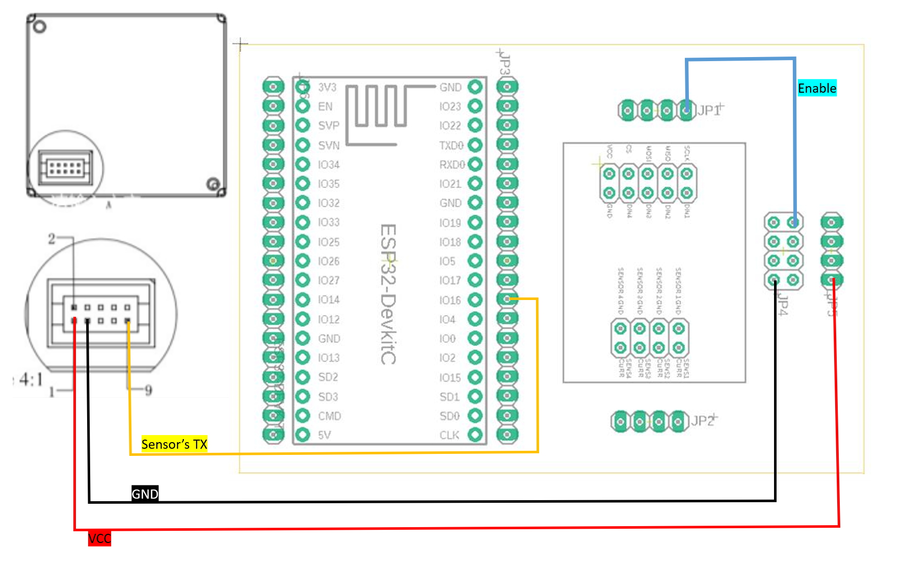

# Analog and Digital Sensors configuration guide for Verified Telemetry.

## Table of Contents

* [General Overview](#general-overview)
* [Sample configuration for only Analog](#sample-configuration-for-only-analog-sensors)
* [Sample configuration for only Digital](#sample-configuration-for-only-digital-sensors)
* [Sample configuration for both Analog and Digital Sensors](#sample-configuration-for-both-analog-and-digital-sensors)
* [Modifying ADC, GPIO, Hardware Definitions of sample and new sensors](#modifying-adc-gpio-hardware-definitions-of-sample-and-new-sensors)
* [Adding new sensors to the sample](#adding-new-sensors-to-the-sample)

## General Overview

Verified Telemetry supports both Analog and Digital Sensors for which we have developed different Fingerprinting Technologies, to use only one type of sensors or to add more sensors, minimal changes are required to [sample_freertos_verified_telemetry_init.c](sample_freertos_verified_telemetry_init.c) file which are described below.

## Sample configuration for only Analog Sensors

* the sample needs to be configured for only 2 Analog sensors, use the below schematic for connections, and the following instructions for changes in the [sample_freertos_verified_telemetry_init.c](sample_freertos_verified_telemetry_init.c) file.
* to modify preexisting Hardware Definitions refer [Modifying ADC, GPIO, Hardware Definitions of sample and new sensors](#modifying-adc-gpio-hardware-definitions-of-sample-and-new-sensors).

* ESP32 Connections 

    * ESP32 Connection Schematic
    
    
      | Sensor Name     | Sensor Pin | MCU Pin  | DOIT ESP32 Devkit |
      |-----------------|------------|----------|-------------------|
      | Soil Moisture 1 | Analog Out | ADC1 CH4 | D32               |
      | Soil Moisture 1 | VCC        | GPIO18   | D18               |
      | Soil Moisture 1 | GND        | GND      | GND               |
      | Soil Moisture 2 | Analog Out | ADC1 CH5 | D33               |
      | Soil Moisture 2 | VCC        | GPIO19   | D19               |
      | Soil Moisture 2 | GND        | GND      | GND               |
    
* STM Connections

    * STM Connection Schematic
    
    
       | Sensor Name   | Sensor Pin           | MCU Pin | Devkit Pin |
       |---------------|----------------------|-----------------------------|------------|
       | Soil Moisture 1 | Analog Out           | PC0                           | A5        |
       | Soil Moisture 1 | VCC                  | PB9                          | D14        |
       | Soil Moisture 1 | GND                  | GND                          | GND        |
       | Soil Moisture 2       | Analog Out  | PC1                           | A4        |
       | Soil Moisture 2       | VCC                  | PB8                           | D15       |
       | Soil Moisture 2       | GND                  | GND                           | GND       |
    
    
* Changes in file [sample_freertos_verified_telemetry_init.c](sample_freertos_verified_telemetry_init.c)

    * Comment lines 13 & 15
    
            //#define BOTH_ANALOG_AND_DIGITAL_SENSORS
            #define ONLY_ANALOG_SENSORS
            //#define ONLY_DIGITAL_SENSORS


## Sample configuration for only Digital Sensors

* the sample needs to be configured for only 2 Digital sensors, use the below schematic for connections, and the following instructions for changes in the [sample_freertos_verified_telemetry_init.c](sample_freertos_verified_telemetry_init.c) file.
* to modify preexisting Hardware Definitions refer [Modifying ADC, GPIO, Hardware Definitions of sample and new sensors](#modifying-adc-gpio-hardware-definitions-of-sample-and-new-sensors).


* ESP32 Connections 

    * ESP32 Connection Schematic
    
    
      | Sensor Name   | Sensor Pin           | MCU Pin | ESP32 Devkit Baseboard PCB Pin |
      |---------------|----------------------|-----------------------------|------------|
      | Cubic PM2012 | Sensor’s TX (PIN 9)   | RX                          | RX(IO16)                    |
      | Cubic PM2012 | VCC (PIN 1)           | -                           | JP5                   |
      | Cubic PM2012 | GND (PIN 3)           | -                           | SENS1GND (JP4)        |    
    
    * ESP32 CS PCB Connections
    
    * ESP32 Sample Setup
    
    
* STM Connections

    * STM Connection Schematic
    
    
       | Sensor Name   | Sensor Pin           | MCU Pin | STM Devkit Baseboard PCB Pin |
       |---------------|----------------------|-----------------------------|------------|
       | Cubic PM2012 | Sensor’s TX (PIN 9)           | RX                           | RX        |
       | Cubic PM2012 | VCC (PIN 1)                  | VCC                          | VCC        |
       | Cubic PM2012       | GND (PIN 3)  | GND                           | GND        |    
    
    * STM CS PCB Connections
    
    * STM Sample Setup
    
    
* Changes in file [sample_freertos_verified_telemetry_init.c](sample_freertos_verified_telemetry_init.c)

    * Comment lines 13 & 14
    
            //#define BOTH_ANALOG_AND_DIGITAL_SENSORS
            //#define ONLY_ANALOG_SENSORS
            #define ONLY_DIGITAL_SENSORS
         

## Sample configuration for both Analog and Digital Sensors

* the default sample is configured for 2 Analog and 2 Digital sensors, use the below schematic for connections.
* to modify preexisting Hardware Definitions refer [Modifying ADC, GPIO, Hardware Definitions of sample and new sensors](#modifying-adc-gpio-hardware-definitions-of-sample-and-new-sensors).


    * ESP32 Connection Schematic
    
    
      | Sensor Name   | Sensor Pin           | MCU Pin | ESP32 Devkit Baseboard PCB Pin |
      |---------------|----------------------|-----------------------------|------------|
      | Cubic PM2012 | Sensor’s TX (PIN 9)   | RX                          | RX(IO16)                    |
      | Cubic PM2012 | VCC (PIN 1)           | -                           | JP5                   |
      | Cubic PM2012 | GND (PIN 3)           | -                           | SENS1GND (JP4)        |
      | Soil Moisture 1 | Analog Out | ADC1 CH4 | IO32               |
      | Soil Moisture 1 | VCC        | GPIO18   | IO18               |
      | Soil Moisture 1 | GND        | GND      | GND               |
      | Soil Moisture 2 | Analog Out | ADC1 CH5 | IO33               |
      | Soil Moisture 2 | VCC        | GPIO19   | IO19               |
      | Soil Moisture 2 | GND        | GND      | GND               |      
   
    * STM Connection Schematic
    
    
       | Sensor Name   | Sensor Pin           | MCU Pin | STM Devkit Baseboard PCB Pin |
       |---------------|----------------------|-----------------------------|------------|
       | Cubic PM2012 | Sensor’s TX (PIN 9)           | RX                           | RX        |
       | Cubic PM2012 | VCC (PIN 1)                  | VCC                          | VCC        |
       | Cubic PM2012       | GND (PIN 3)  | GND                           | GND        |'
       | Soil Moisture 1 | Analog Out           | PC0                           | A5        |
       | Soil Moisture 1 | VCC                  | PB9                          | D14        |
       | Soil Moisture 1 | GND                  | GND                          | GND        |
       | Soil Moisture 2       | Analog Out  | PC1                           | A4        |
       | Soil Moisture 2       | VCC                  | PB8                           | D15       |
       | Soil Moisture 2       | GND                  | GND                           | GND       |    
    
    
* Changes in file [sample_freertos_verified_telemetry_init.c](sample_freertos_verified_telemetry_init.c)

    * Comment lines 14 & 15
    
            #define BOTH_ANALOG_AND_DIGITAL_SENSORS
            //#define ONLY_ANALOG_SENSORS
            //#define ONLY_DIGITAL_SENSORS
    
## Modifying ADC, GPIO, Hardware Definitions of sample and new sensors
    
* Hardware Definitions are present in file sample_vt_device_driver.c and is externed in sample_vt_device_driver.h, for any new sensor or to modify current hardware, check the instruction below.

* for ESP32 
   
   * got to file [sample_vt_device_driver.c](../projects/ESPRESSIF/esp32/verified-telemetry/sample_vt_device_driver.c) and add/modify Hardware Definitions under ``` /* Sensor Hardware Definitions */ ```
   * got to file [sample_vt_device_driver.h](../projects/ESPRESSIF/esp32/verified-telemetry/sample_vt_device_driver.h) and extern any new/modified Hardware Definitions under ``` /* Sensor Hardware Declaration */ ```

* for STM 
   
   * got to file [sample_vt_device_driver.c](../projects/ST/b-l475e-iot01a/st_code/sample_vt_device_driver.c) and add/modify Hardware Definitions under ``` /* Sensor Hardware Definitions */ ```
   * got to file [sample_vt_device_driver.h](../projects/ST/b-l475e-iot01a/st_code/sample_vt_device_driver.h) and extern any new/modified Hardware Definitions under ``` /* Sensor Hardware Declaration */ ```
   * 
## Adding new sensors to the sample 

* To add new sensors to the sample, the following changes are required in [sample_freertos_verified_telemetry_init.c](sample_freertos_verified_telemetry_init.c).

1. Add new VT_SENSOR_HANDLE & FreeRTOS_VT_OBJECT according to the type of sensor.
   
   * to add an Analog Sensor, add new VT_SENSOR_HANDLE & FreeRTOS_VT_OBJECT between lines 21 & 26 
         
            #if defined(BOTH_ANALOG_AND_DIGITAL_SENSORS) || defined(ONLY_ANALOG_SENSORS)
                static FreeRTOS_VT_OBJECT sample_signature_sensor_1;
                static FreeRTOS_VT_OBJECT sample_signature_sensor_2;
                static FreeRTOS_VT_OBJECT sample_signature_sensor_N; // <- replace N with the number of the sensor
                static VT_SENSOR_HANDLE sample_handle_sensor_1;
                static VT_SENSOR_HANDLE sample_handle_sensor_2;
                static VT_SENSOR_HANDLE sample_handle_sensor_N;      // <- replace N with the number of the sensor
            #endif
            
   * to add a Digital Sensor, add new VT_SENSOR_HANDLE & FreeRTOS_VT_OBJECT between lines 30 & 35 
         
            #if defined(BOTH_ANALOG_AND_DIGITAL_SENSORS) || defined(ONLY_DIGITAL_SENSORS)
                static FreeRTOS_VT_OBJECT sample_signature_sensor_1;
                static FreeRTOS_VT_OBJECT sample_signature_sensor_2;
                static FreeRTOS_VT_OBJECT sample_signature_sensor_N; // <- replace N with the number of the sensor
                static VT_SENSOR_HANDLE sample_handle_sensor_1;
                static VT_SENSOR_HANDLE sample_handle_sensor_2;
                static VT_SENSOR_HANDLE sample_handle_sensor_N;      // <- replace N with the number of the sensor
            #endif     
            
2. Call init function according to the type of sensor

      * to add an Analog Sensor, call vt_analog_sensor_signature_init() between lines 130 & 156 
         
       #if defined(BOTH_ANALOG_AND_DIGITAL_SENSORS) || defined(ONLY_ANALOG_SENSORS)

           vt_analog_sensor_signature_init(&verified_telemetry_DB,
                                           &sample_signature_sensor_N,
                                           (UCHAR*)"newAnalogSensorN",
                                           true,
                                           vt_adc_id_sensor_N,
                                           (void*)&vt_adc_controller_sensor_N,
                                           (void*)&vt_adc_channel_sensor_N,
                                           vt_gpio_id_sensor_N,
                                           (void*)vt_gpio_port_sensor_N,
                                           (void*)&vt_gpio_pin_sensor_N,
                                           &sample_handle_sensor_N);

       #endif
       
      * to add an Digital Sensor, call vt_digital_sensor_signature_init() between lines 158 & 184 
         
       #if defined(BOTH_ANALOG_AND_DIGITAL_SENSORS) || defined(ONLY_DIGITAL_SENSORS)

           vt_digital_sensor_signature_init(&verified_telemetry_DB,
                                           &sample_signature_sensor_N,
                                           (UCHAR*)"newDigitalSensorN",
                                           true,
                                           vt_adc_id_sensor_N,
                                           (void*)&vt_adc_controller_sensor_N,
                                           (void*)&vt_adc_channel_sensor_N,
                                           CURRENTSENSE_EXTERNAL_ADC_REF_VOLT,
                                           CURRENTSENSE_EXTERNAL_ADC_RESOLUTION,
                                           (1.0f / (CURRENTSENSE_SHUNT_RESISTOR * CURRENTSENSE_OPAMP_GAIN)),
                                           &sample_handle_sensor_N);

       #endif       
       
            
